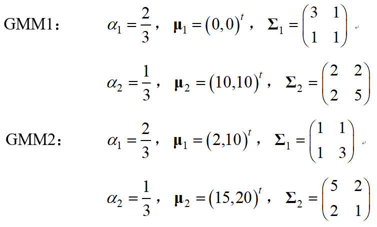

**一、** **实验内容**

1、  实现GMM算法：要求独立完成算法编程，禁止调用已有函数库或工具箱中的函数；

2、  使用仿真数据测试算法的正确性：两类2维各1000个训练样本Train1和Train2分别采样自如下两个GMM，使用训练样本分别估计包含2个分量高斯的GMM参数。

​     

构造区分两类的GMM分类器，测试采样自同样GMM的测试样本Test1和Test2。

3、  MNIST数据集测试：使用TrainSamples中的30000个17维特征手写数字样本训练GMM分类器区分10个类别，TrainLabels中包含训练样本的标签；测试设置不同高斯数量GMM分类器对TestSamples中10000个样本的识别正确率。

**二、** **实验结果**

1、  仿真数据实验结果：给出估计出的两个GMM 模型参数，以及测试样本的识别结果。

GMM估计模型参数

|             | $\alpha$ | $\boldsymbol{\mu}$ | $\boldsymbol{\Sigma}$ |
| ----------- | ------------------------------------------------------------ | ------------------------------------------------------------ | ------------------------------------------------------------ |
| GMM1-Gauss1 | 0.658906074838                                               | (-0.04877167,   -0.03493018)                                 | [\[2.85162744  0.97072848][0.97072848 0.96895104]]           |
| GMM1-Gauss2 | 0.341093925162                                               | (9.97026702   ,   9.95347361)                                | [\[ 2.01631182  2.35543218][ 2.35543218 5.31829583]]         |
| GMM2-Gauss1 | 0.66799981591                                                | (2.02206041,  10.16700955)                                   | [\[ 0.96728744  0.91060643][ 0.91060643 2.74892245]]         |
| GMM2-Gauss2 | 0.33200018409                                                | (14.97097407,  19.99245787)                                  | [\[5.28809396  2.18044655][ 2.18044655 1.12285598]]          |

 

**GMM** **分类器识别结果**

|       | 正确识别数 | 正确识别率 |
| ----- | ---------- | ---------- |
| Test1 | 1000       | 100%       |
| Test2 | 1000       | 100%       |

 

2、  MNIST数据集实验结果：

**GMM** **分类器识别正确率**

| 高斯数     | 1      | 2      | 3      | 4      | 5      |
| ---------- | ------ | ------ | ------ | ------ | ------ |
| 正确识别数 | 9263   | 9385   | 9438   | 9469   | 9507   |
| 正确识别率 | 0.9263 | 0.9385 | 0.9438 | 0.9469 | 0.9507 |

