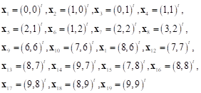
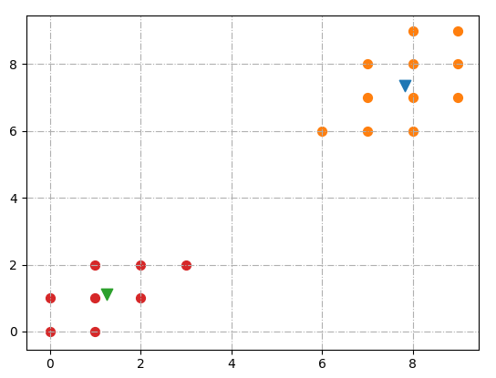

**一、** **实验内容**

1、  实现K-均值聚类算法：要求独立完成算法编程，禁止调用已有函数库或工具箱中的函数；

2、  使用仿真数据测试算法的正确性：将下列19个样本聚成2个聚类：

3、  MNIST数据集测试：ClusterSamples中的10000个784维特征手写数字样本聚类为10个类别，根据SampleLabels中的标签统计每个聚类中不同样本的数量。测试不同初始值对聚类结果的影响。

**二、** **实验结果**

1、  仿真数据实验结果：（可以列出每个聚类中包含的样本，也可以画图显示不同聚类）

- 簇1：
  - Center:  [ 1.25   1.125]
  - Items:  [[0, 0], [1, 0], [0, 1], [1, 1], [2, 1], [1, 2], [2, 2], [3, 2]]

- 簇2：
  - Center:  [ 7.81818182  7.36363636]
  - Items:  [[6, 6], [7, 6], [8, 6], [7, 7], [8, 7], [9, 7], [7, 8], [8, 8], [9, 8], [8, 9], [9, 9]]

 

2、  MNIST数据集实验结果：

**每个聚类中包含不同类别样本数量统计表**

|       |  0   | 1    | 2    | 3    | 4    | 5    | 6    | 7    | 8    | 9    |
| ----- | :--: | ---- | ---- | ---- | ---- | ---- | ---- | ---- | ---- | ---- |
| 聚类0 |  23  | 3    | 44   | 643  | 0    | 301  | 6    | 1    | 188  | 13   |
| 聚类1 | 420  | 0    | 17   | 18   | 1    | 36   | 28   | 1    | 4    | 0    |
| 聚类2 |  26  | 0    | 33   | 11   | 33   | 17   | 798  | 3    | 15   | 1    |
| 聚类3 |  1   | 1    | 31   | 32   | 493  | 45   | 15   | 294  | 32   | 472  |
| 聚类4 |  2   | 3    | 3    | 8    | 321  | 44   | 0    | 631  | 28   | 443  |
| 聚类5 |  2   | 2    | 726  | 28   | 5    | 5    | 20   | 5    | 12   | 3    |
| 聚类6 |  6   | 419  | 54   | 18   | 70   | 183  | 50   | 67   | 101  | 28   |
| 聚类7 |  28  | 1    | 20   | 172  | 6    | 285  | 15   | 3    | 548  | 14   |
| 聚类8 |  0   | 697  | 65   | 57   | 28   | 14   | 33   | 52   | 46   | 33   |
| 聚类9 | 452  | 0    | 1    | 3    | 2    | 11   | 14   | 1    | 5    | 7    |

 