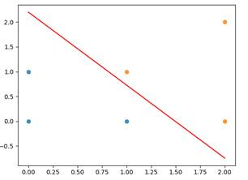
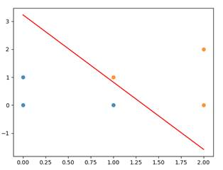
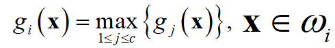

**一、** **实验内容**

1、  实现感知器算法和最小平方误差算法；

2、  分别使用感知器算法学习区分下列两类样本的线性分类器：


3、  MNIST数据集测试：使用TrainSamples中的30000个17维特征手写数字样本训练线性分类器区分10个类别，TrainLabels中包含训练样本的标签；测试线性分类器对TestSamples中10000个样本的识别正确率。

**二、** **实验结果**

1、  仿真数据实验结果：分别给出使用感知器算法和最小平方误差算法得到的线性判别函数。

感知器算法：

F(x1, x2) = 0.26784988*x1 + 0.18176198*x2 - 0.4



最小平方误差算法:

F(x1, x2) = 0.4469281*x1 + 0.185913*x2 – 0.6



2、  MNIST数据集实验结果：（多类别解决方案及分类正确率）

- 多类别解决方案：使用如下判别准则



- 分类正确率：
  - 感知器算法：

       ```
       				precision    recall  f1-score   support
                 0      0.902     0.888     0.895      1025
                 1      0.917     0.894     0.905      1179
                 2      0.767     0.838     0.801       882
                 3      0.798     0.755     0.776      1080
                 4      0.831     0.833     0.832       958
                 5      0.687     0.704     0.695       895
                 6      0.895     0.896     0.896       973
                 7      0.876     0.864     0.870      1061
                 8      0.758     0.726     0.741      1007
                 9      0.734     0.777     0.755       940
                 
       avg / total      0.821     0.820     0.820     10000
       Test acc: 0.8196
       ```


  - 最小平方误差算法:

                         precision    recall  f1-score   support
                    0      0.932     0.799     0.860      1176
                    1      0.926     0.740     0.823      1439
                    2      0.619     0.831     0.710       717
                    3      0.790     0.687     0.735      1175
                    4      0.861     0.729     0.789      1135
                    5      0.463     0.822     0.593       517
                    6      0.892     0.802     0.845      1083
                    7      0.864     0.743     0.799      1218
                    8      0.720     0.731     0.725       951
                    9      0.503     0.849     0.632       589
                    
           avg / total      0.802     0.763     0.772     10000
           Test acc: 0.7629
